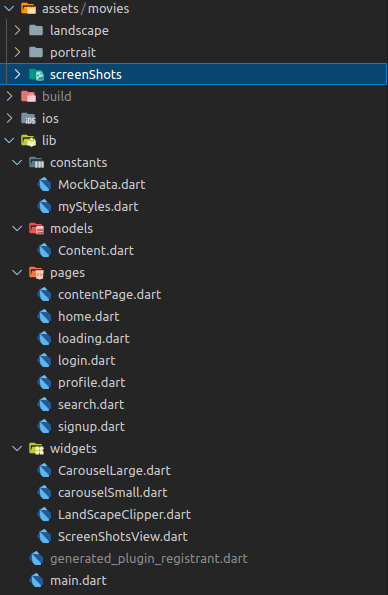

# POPCORN

A front-end entertainment streaming application like that of netflix. All the data used is inside the MockData file which contains final data sets.

## Screens
There are in total seven screens as follows - 
+ **Loader** : This screen's purpose is to run asynchrounous code before starting the application. During the run time of code, this screen serves as progess/indicator or animated logo loader.
+ **Login** and **SignUp** : These screens allow users ot login and sign up respectively. For now, on submit, it stores the data in **sharedPreferences**.
+ **Home** : Hosts basic home screen of the application containing several large and small carousels, search and profile option.
+ **Search** : A screen dedicated exclusively for seaching contents.
+ **Profile** : Profile menu hosting profile editing options, app sharing link and few settings of the application along with *SignOut* button.
+ **Content** : A page which displays the details of paticular content, allows user to add it to wishlist and share the particular content details in any other medium(whatsapp / message). It will be from here onwards only that the user will be able to play that title.

## Application Flow
The loader screen, while displaying logo animation decides which screen to route to next. If there is already user details stored in the sharedPreferences, then we just jump to Home screen otherwise route to SignUp screen.

The signup and login screen are connected in the sense that it allows switching between the two option i.e., login or signup.

In Home screen, we can browse through titles in the infinitely repeating carousels and tap them to go to their respective content page. The search and profile icons opens dedicated search and profile pages respectively.

## Application structure
 

## Notes
+ Carousel large is implemented like this. It return a pageview.builder which returns a animation builder. In animation builder, builder returns an animated sized box which hosts the child image.
+ ContentPage custom clipper user a customclipper to create that particular shape then paints it with shadow using custompainter and embeds the child on that shape.

